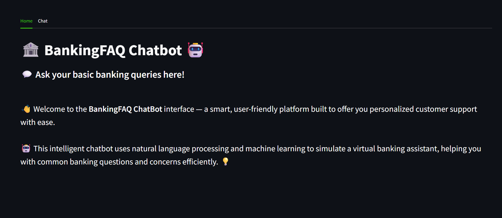
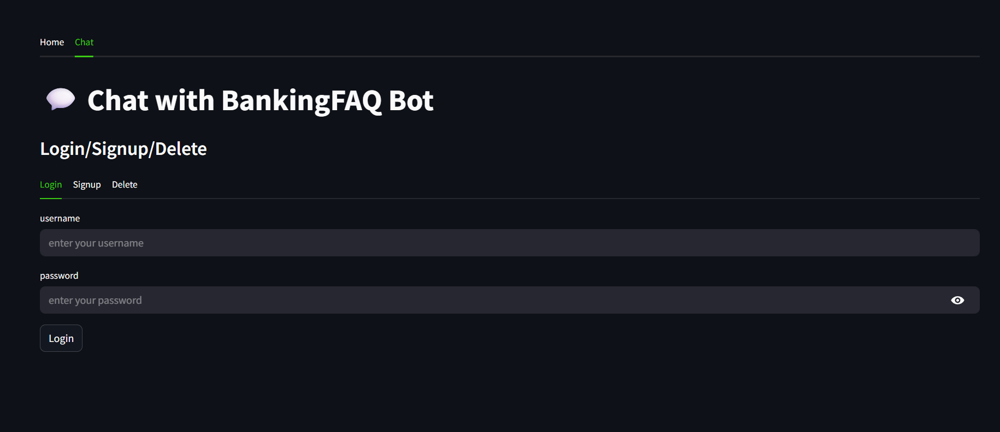
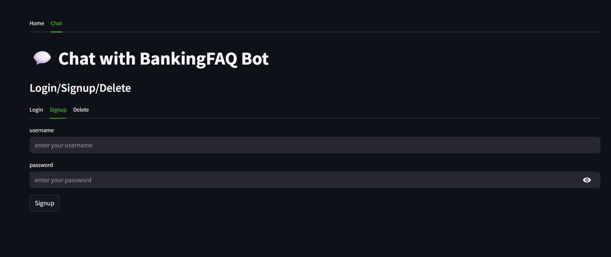
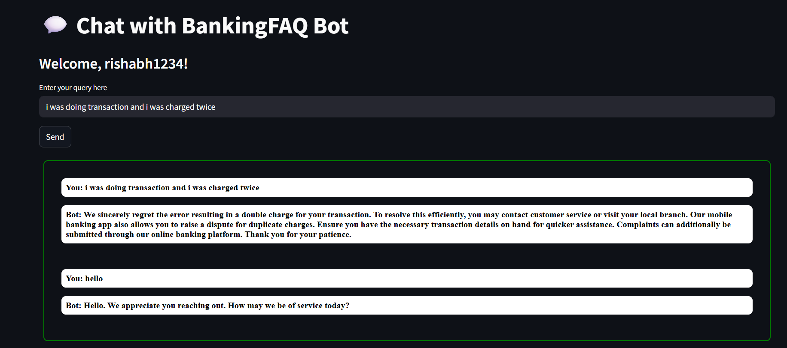

# 📚 NLP Based Banking Chatbot

This is a **Banking FAQ Chatbot** where:

- The **frontend** is built using **Streamlit**
- The **backend** is powered by **FastAPI**
- The two are connected using **CORS**

---

## 🚀 Features

1. **Smart Query Response 🧠**
   Provides intelligent answers to user queries using an intent prediction model.

2. **User Authentication 🔐**  
   Users can sign up, log in, log out, and delete their account securely.

3. **Chat History Management 💬**
   Stores each user's queries and chatbot responses in a SQLite3 database for persistence.

---

## 🧠 How It Works

- The chatbot **preprocesses** user input and vectorizes it using a **Bag of Words** model with ngram_range=(1, 2).
- The vectorized text is passed to a **Logistic Regression classifier** (multi_class='multinomial'), which achieves a **~94% test accuracy**.
- The model predicts the **intent probabilities**, and the intent with the **highest probability** is selected.
- To reduce hallucinations and increase response accuracy, a **confidence score threshold** is used.
- Based on the predicted intent, the bot picks a **random response** from a list of predefined replies for that intent.
- User data (username, password) and chat data (user input, bot response) are stored using **SQLite3**.
- Pydantic's BaseModel is used to define and validate **User** and **Chat** schemas.

---

## 🛠️ Tech Stack

- **Frontend**: Streamlit (Python)
- **Backend**: FastAPI (Python)
- **Database**: SQLite3
- **Machine Learning**: Text Intent Classification using Natural Language Processing (NLP)
- **Interfacing**: CORS (Flask-CORS)

---

## Screenshots

### Homepage



### Login Page



### Signup Page



### Delete Page


### Chatbot Interface



## ⭐ Star the Repository

If you find this project useful, please consider giving it a star! Your support helps the project grow and reach more people.

## Prerequisites

- Python 3.13
- FastAPI 3.1.1
- Streamlit 1.45.1
- SQLAlchemy 2.0.41
- Uvicorn 0.34.2
- Other dependencies listed in `requirements.txt`

## Installation

### Local Installation

1. Clone the repository:

```bash
git clone https://github.com/rishabhpancholi/banking-chatbot-nlp.git

```

2. Create and Activate your virtual environments in both server and client directories:

```bash

python -m venv venv
venv\Scripts\activate

```

2. Install dependencies using pip:

```bash
pip install -r requirements.txt
```

Or if you want to install in development mode:

```bash
pip install -e .

```

3. Run client and server side code seperately:

```bash
cd client
streamlit run app.py --server port [port-number]

```

for client

```bash
cd server
uvicorn app:app
```

4. Open your browser and navigate to `http://localhost:[port-number]`

## Contributing

Contributions are welcome! Please feel free to submit a Pull Request.

## License

This project is licensed under the MIT License - see the LICENSE file for details.

## Live Demo

https://rishabhpancholi-banking-chatbot-nlp-clientapp-wm9sen.streamlit.app/

- ✅ **Frontend** (Streamlit) is deployed on **Streamlit Cloud**
- ✅ **Backend** (FastAPI) is deployed on **Render**
